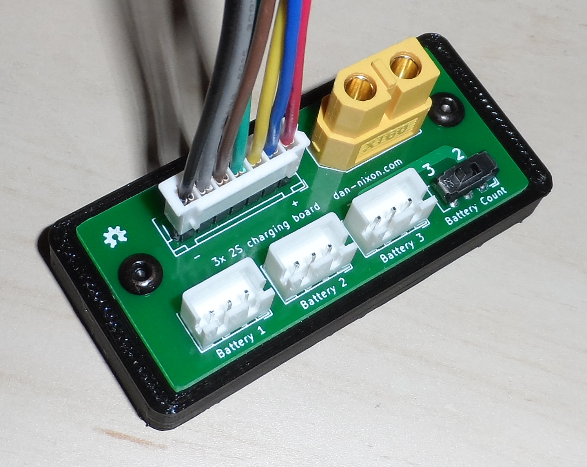

# 3x 2S battery charging board

Board to enable charging multiple 2S batteries at once.

Should only be used for low charge currents, e.g. for batteries for small burshless quads like the TinyHawk.

